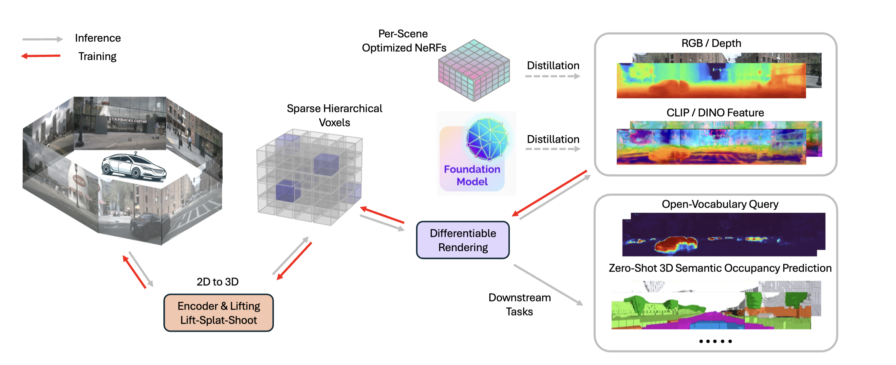

## [NeurIPS 2024] DistillNeRF: Perceiving 3D Scenes from Single-Glance Images by Distilling Neural Fields and Foundation Model Features

We introduce DistillNeRF, a generalizable model for 3D scene representation, self-supervised by natural sensor streams along with distillation from offline NeRFs and vision foundation models. It supports rendering RGB, depth, and foundation feature images, without test-time per-scene optimization, and enables downstream tasks such as zero-shot 3D semantic occupancy prediction and open-vocabulary text queries.

<p align="center">
  
</p>


> [Letian Wang](https://letian-wang.github.io/), [Seung Wook Kim](https://seung-kim.github.io/seungkim/), [Jiawei Yang](https://jiawei-yang.github.io/), [Cunjun Yu](https://scholar.google.com/citations?user=4xwyGM8AAAAJ&hl=en), [Boris Ivanovic](https://www.borisivanovic.com/), [Steven L. Waslander](https://scholar.google.com.hk/citations?hl=zh-CN&user=jY_Bcd8AAAAJ&view_op=list_works&sortby=pubdate), [Yue Wang](https://yuewang.xyz/), [Sanja Fidler](https://www.cs.utoronto.ca/~fidler/), [Marco Pavone](https://web.stanford.edu/~pavone/), [Peter Karkus](https://karkus.tilda.ws/)

- Webpage: https://distillnerf.github.io/
- Paper: https://arxiv.org/abs/2406.12095
- Video: https://www.youtube.com/watch?v=HRRmYGubTEU


## Contents
- [Installation](#installation)
- [Code Structure](#code-structure)
- [Dataset preparation](#dataset-preparation)
- [Run code](#run-code)
  - [Data Inspection](#data-inspection)
  - [Training](#training)
- [Visualizations with trained models](#visualizations-with-trained-models)
- [Citation](#citation)
- [Acknowledgement](#acknowledgement)
- [Licence](#licence)
  - [All Rights Reserved](#all-rights-reserved)
  - [Proprietary and Confidential](#proprietary-and-confidential)
  - [External Licence](#external-licence)

## Installation

Our code is developed on Ubuntu 22.04 using Python 3.8 and PyTorch 1.13.1+cu116. Please note that the code has only been tested with these specified versions. We recommend using conda for the installation of dependencies.

Create the `distillnerf` conda **environment** and install all dependencies:

```shell
conda create -n distillnerf python=3.8 -y
conda activate distillnerf
. setup.sh
export PYTHONPATH=.
```

## Code Structure
Our code base is built on `mmdetection3d`, where we implement our model, config files, data loader, losses, hooks, and utils in `projects/DistillNeRF`. 
  ```
  DistillNeRF
  ├── ...
  ├── projects/
  │   ├── DistillNeRF/
  │   │   ├── configs       # Config files
  │   │   ├── datasets      # Customized data loader
  │   │   ├── hooks         # Customized WandB logging hooks 
  │   │   ├── losses        # Customized losses
  |   |   ├── models        # DistillNeRF model, model wrapper, and model components
  |   |   ├── modules       # Other components used in our model
  |   |   ├── pipelines     # Customized data reading
  |   |   ├── utils         # util tools
  ├── ...
  ```
We also provide scripts for creating docker in `docker`, running different variants of our model in `sample_scripts`, lauching training in slurm in `slurm_script`, and some visualization tools in `tools`.
## Dataset preparation

- **NuScenes Dataset**: See [NuScenes Dataset Preparation](docs/NUSCENES.md) for detailed instructions on preparing the NuScenes dataset and additional needed files
- **Waymo Dataset** See [Waymo NOTR Dataset Preparation](docs/WAYMO.md) for detailed instructions on preparing the NuScenes dataset.

1. **Prepare depth images for distillation**
   
   In this paper, we train offline per-scene NeRF, render depth images and save them to the `data/nuscenes/` or `data/waymo/` directory respectively. We'll release the depth images used in our paper soon. 
   
   In this repo, we also prepare some temporary data, so that at least you can run through the code, and train a model without depth supervision from per-scene NeRFs. 
   To do that, download this [Temporary File](https://drive.google.com/drive/folders/1n11IZAqzF1lKlhDhtRr0sifhj4zybE0y?usp=sharing) and place it at the root directory of the repo. We have changed the `SKIP_MISSING` parameter in the dataset config (e.g. `projects.DistillNeRF.configs.datasets.dataset_config.py`) to be True, so that the dataloader will load these temporary data files. When you start to train your model, turn `SKIP_MISSING` to be False, to avid data mis-loading.

   Note that, please only use these data if you have agreed to the terms for non-commercial use from nuScenes https://www.nuscenes.org/nuscenes. The preprocessed dataset are under the [CC BY-NC-SA 4.0 licence](https://creativecommons.org/licenses/by-nc-sa/4.0/legalcode).

2. **Download auxiliary models**

    From [DepthAnything](https://github.com/LiheYoung/Depth-Anything/?tab=readme-ov-file), download the pretrained weight `depth-anything-base`, which is used to generate depth features.

    Download [PointRend](https://dl.fbaipublicfiles.com/detectron2/PointRend/SemanticSegmentation/pointrend_semantic_R_101_FPN_1x_cityscapes/202576688/model_final_cf6ac1.pkl) model weight, which is used to generate sky masks.

    Create a new directory named `aux_models`, and put these two models under this directory.


  3. **Folder structure**
   The final directory should look like this
      ```
      DistillNeRF
      ├── ...
      ├── aux_models/
      │   ├── depth_anything_vitb14.pth
      │   ├── model_final_cf6ac1.pkl
      ├── checkpoint/
      ├── data/
      │   ├── nuscenes/
      │   │   ├── maps/
      │   │   ├── samples/
      │   │   ├── sweeps/
      │   │   ├── v1.0-test/
      |   |   ├── nuscenes_infos_train_sweeps.pkl
      |   |   ├── nuscenes_infos_val_sweeps.pkl
      |   |   ├── nuscenes_infos_val_temporal_v2.pkl
      │   ├── waymo/
      │   │   ├── kitti_format/
      │   │   ├── waymo_format/
      ├── templt_files/
      ├── ...
      ```


## Run code

Here we provide scripts to visualize the data, training, and visualize the predictions. If you're running the model locally with limited compute, you could append this line of argments after your script (after `--cfg-options`), so that the model only loads 1 camera instead of 6 cameras, which should be runnable in most machines. 

```
model.num_camera=1
```

Below we provide code for NuScenes, and please refer to the last section in [here](docs/waymo.md) for instructions on waymo.

### Data Inspection

Before initiating the training, you might want to inspect the data and some initial predictions from our model. We've included scripts for visualizing the them.

1. **visualize images**

To run through the one DistillNeRF model (incorporating parameterized space and depth distillation), use

```****
python tools/train.py ./projects/DistillNeRF/configs/model_wrapper/model_wrapper.py --seed 0 --work-dir=../work_dir_debug --cfg-options model.visualize_imgs=True
```
Sample scripts for more models can be found in `sample_scripts/visualize_images`


2. **visualize voxels**
   
To run through the one DistillNeRF model (incorporating parameterized space and depth distillation), use

```****
python tools/train.py ./projects/DistillNeRF/configs/model_wrapper/model_wrapper.py --seed 0 --work-dir=../work_dir_debug --cfg-options model.visualize_voxels=True
```
where we simply enable `visualize_voxels` to be True, instead of `visualize_images`. Sample scripts for more models can be found in `sample_scripts/visualize_voxels`


### Training

1. **Wandb setup (optional)**
   
Before start training, you may want to set up the wandb in order to log the metrics/predictions. 

You can run the script `wandb online` or `wandb offline` to choose wheter the logs will be uploaded to the cloud or saved locall. 

To set up your wandb account, you can follow the wandb prompt after you launch training. You can also uncomment these lines in `tools/train.py` and add you `WANDB_API_KEY` in advance.

```
os.environ["WANDB_API_KEY"] = 'YOUR_WANDB_API_KEY'
os.environ["WANDB_MODE"] = "online"
```

2. **Training script**
   
To run through one DistillNeRF model (without depth distillation, without parameterized space), use

```
python tools/train.py ./projects/DistillNeRF/configs/model_wrapper/model_wrapper_linearspace_no_depth_distilll.py --seed 0 --work-dir=../work_dir_debug
```

We also provide a slurm scritp example for training this model
```
. ./slurm_scripts/launch_nuscenes_linearspace_no_depth_distill.sh
```

See For more scripts for different variants of our model, refer to the `sample_scripts/training`.


## Visualizations with trained models 

Download the [Trained Model Weight](https://drive.google.com/drive/folders/1EtDbG-dXec6kygOG6XeTPjrbzCLCrD1n?usp=sharing), to inspect the visualize predictions from our model.

Note that, please only use these models if you have agreed to the terms for non-commercial use from nuScenes https://www.nuscenes.org/nuscenes. The models are under the [CC BY-NC-SA 4.0 licence](https://creativecommons.org/licenses/by-nc-sa/4.0/legalcode).


After you obtain a trained model, we provide additional scripts to visualize the images and voxels, and also novel view synthesis, as below. The visualizations will be saved into a default directory. You can choose to not save the visualization by appending `model.save_visualized_imgs=False` to your command, and change the saving directory by appending `model.vis_save_directory=YOUR_VIS_DIR`.


1. **visualize images**

To run through one DistillNeRF model (no parameterized space), use

```
python ./tools/visualization.py ./projects/DistillNeRF/configs/model_wrapper/model_wrapper_linearspace.py ./checkpoint/model_linearspace.pth --cfg-options model.visualize_imgs=True
```


For more examples, refer to the `sample_scripts/visualization_images_with_model`.


2. **visualize voxels**
To run through one DistillNeRF model (incorporating parameterized space), use

```   
python ./tools/visualization.py ./projects/DistillNeRF/configs/model_wrapper/model_wrapper.py ./checkpoint/model.pth --cfg-options model.visualize_voxels=True
```

For more examples, refer to the `sample_scripts/visualization_voxels_with_model`.

3. **foundation model feature visualization**

To visvualize DINO feature, run
```   
python ./tools/visualization.py ./projects/DistillNeRF/configs/model_wrapper/model_wrapper_linearspace_dino.py ./checkpoint/model_linearspace_dino.pth --cfg-options model.visualize_foundation_model_feat=True
```

To visvualize CLIP feature, run
```
python ./tools/visualization.py ./projects/DistillNeRF/configs/model_wrapper/model_wrapper_linearspace_clip.py ./checkpoint/model_linearspace_clip.pth --cfg-options model.visualize_foundation_model_feat=True 
```

4. **open-vocabulary query**

To conduct open-vocabulary query, use

```   
python ./tools/visualization.py ./projects/DistillNeRF/configs/model_wrapper/model_wrapper_linearspace_clip.py ./checkpoint/model_linearspace_clip.pth --cfg-options model.language_query=True 
```

5. **novel-view synthesis - RGB**

To run through one DistillNeRF model (no parameterized space), use
```
python ./tools/novel_view_synthesis.py ./projects/DistillNeRF/configs/model_wrapper/model_wrapper_linearspace.py ./checkpoint/model_linearspace.pth --cfg-options model.visualize_imgs=True
```

The scripts above will generate 3 novel views. To generate more novel views and create a video, use this command
```
. ./tools/novel_view_synthesis.sh
```
Note that you need to choose with model you want to use, by commenting and uncommenting in `./tools/novel_view_synthesis.sh`.


6. **novel-view synthesis - foundation model feature**

To generate the novel view of DINO feature, use

```
    python ./tools/novel_view_synthesis.py ./projects/DistillNeRF/configs/model_wrapper/model_wrapper_linearspace_dino.py ./checkpoint/model_linearspace_dino.pth --cfg-options model.visualize_foundation_model_feat=True 
```

To generate the novel view of CLIP feature, use

```
    python ./tools/novel_view_synthesis.py ./projects/DistillNeRF/configs/model_wrapper/model_wrapper_linearspace_clip.py ./checkpoint/model_linearspace_clip.pth --cfg-options model.visualize_foundation_model_feat=True 
```

Again, the scripts above will generate 3 novel views. To generate more novel views and create a video, use this command
```
. ./tools/novel_view_synthesis.sh
```
Note that you need to choose with model you want to use, by commenting and uncommenting in `./tools/novel_view_synthesis.sh`.

## Citation
Consider citing our paper if you find this repo or our paper is useful for your research

```bibtex
@misc{wang2024distillnerf,
      title={DistillNeRF: Perceiving 3D Scenes from Single-Glance Images by Distilling Neural Fields and Foundation Model Features}, 
      author={Letian Wang and Seung Wook Kim and Jiawei Yang and Cunjun Yu and Boris Ivanovic and Steven L. Waslander and Yue Wang and Sanja Fidler and Marco Pavone and Peter Karkus},
      year={2024},
      eprint={2406.12095},
      archivePrefix={arXiv},
      primaryClass={id='cs.CV' full_name='Computer Vision and Pattern Recognition' is_active=True alt_name=None in_archive='cs' is_general=False description='Covers image processing, computer vision, pattern recognition, and scene understanding. Roughly includes material in ACM Subject Classes I.2.10, I.4, and I.5.'}
    }
```


## Licence

The source code is released under the [NSCL licence](LICENSE.txt). The preprocessed dataset and pretrained models are under the [CC BY-NC-SA 4.0 licence](https://creativecommons.org/licenses/by-nc-sa/4.0/legalcode).

This implementation is based on [MMDetection3D](https://github.com/open-mmlab/mmdetection3d), following its [licence](LICENSE.mmdetection3d). Thanks for the great works! 

Please also refer to the folder `third_party_notice` for the list of open-source software that we used to process the data, along with their licence.